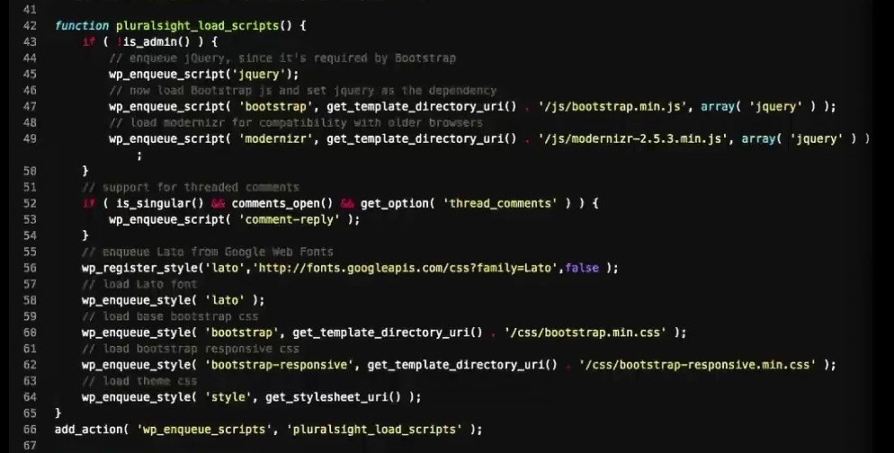

## Правильно подключаем CSS и JS файлы
Правильно подключаем CSS-стили и JS-скрипты верстки макета, чтобы они не конфликтовали друг с другом и файлами плагинов.

В файле functions.php создадим пользовательскую функцию, которая грамотно подключит CSS и JavaScript файлы к теме WordPress:

    function loadStyleSctipt() {
        wp_enqueue_script('hookUpJquery',    get_template_directory_uri().'/js/jquery-1.11.1.min.js');
        wp_enqueue_script('hookUpScript',    get_template_directory_uri().'/js/scripts.js');
        wp_enqueue_style ('hookUpNormalize', get_template_directory_uri().'/css/normalize.css');
        wp_enqueue_style ('hookUpStyle',     get_stylesheet_uri());
    }
    add_action('wp_enqueue_scripts', 'loadStyleSctipt');

Данный код нужно разместить в файле `functions.php`. Поясним, что означает каждая строка функции `loadStyleSctipt()`.
- `loadStyleSctipt()` - пользовательская функция, которую мы создали сами, её имя должно быть отличным от имён встроенных функций WordPress
- `wp_enqueue_script()` - встроенная функция WordPress, используется для безопасного (не конфликтного), упорядоченного подключения JavaScript файлов
- `wp_enqueue_style()` - встроенная функция WordPress, используется для безопасного (не конфликтного), упорядоченного подключения стилей (CSS-файлов)
- `wp_enqueue_scripts` - хук который регистрирует все стили и скрипты

Параметры функции `wp_enqueue_script(par1, par2, [par3], null, false);`
- par3 - массив с зависимостями, указывающий какой файл должен быть подключен перед этим
- null - убирает версию скрипта '?ver=4.9'
- false/true - подключать файл в хедере или подвале

## Подключаем jQuery от WordPress
У WordPress имеется собственный файл jQuery. Вместо строки:
    
    wp_enqueue_script('hookUpJquery', get_template_directory_uri().'/js/jquery-1.11.1.min.js');

Вставляем:

    wp_enqueue_script('jquery');

## header.php
Удаляем из header.php все подключения стилей и скриптов.