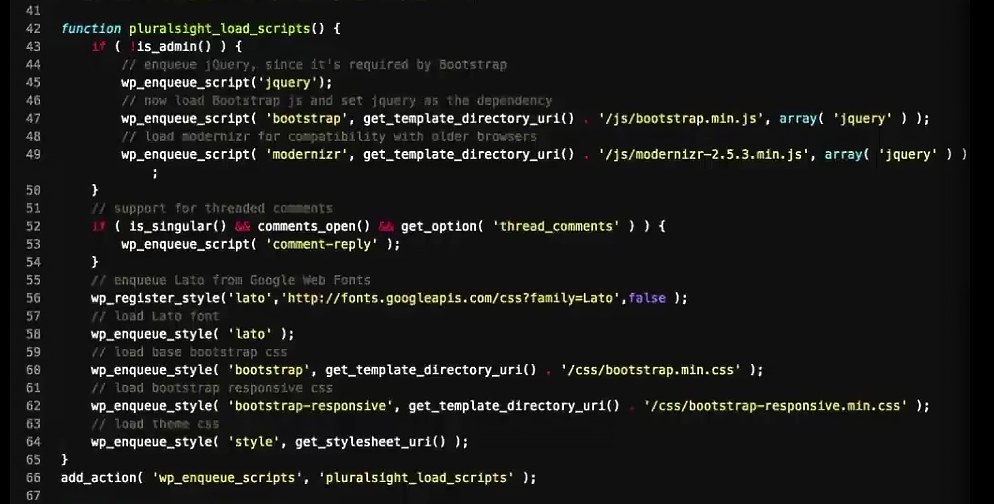

# Подключение CSS и JS-файлов
`wp_enqueue_style()` - регистрирует и подключает css файл  
`wp_enqueue_script()` - регистрирует и подключает js файл  
`wp_enqueue_scripts` - хук для работы с файлами стилей и скриптов

## Для обычной темы

    /**
    * Функция для подключения стилей и скриптов
    */
    function legioner_enqueue_scripts() {
        // Подключаем файл style.css
        wp_enqueue_style( 'legioner-style', get_stylesheet_uri(), array(), '1.0', 'all' );

        // Подключаем файл assets/css/style.css
        // Аргументы: уникальный идентификатор, путь к файлу, массив зависимых файлов, версия скрипта, медиа
        wp_enqueue_style( 'legioner-css-style', get_template_directory_uri() . '/assets/css/style.css', array(), '1.0', 'all' );

        // Подключаем файл assets/js/script.js
        // Аргументы: уникальный идентификатор, путь к файлу, массив зависимых файлов, версия скрипта, разместить в футере
        wp_enqueue_script( 'legioner-js-custom', get_template_directory_uri() . '/assets/js/custom.js', array(), '1.0', true );

        // Нужен для формы комментариев
        if( is_singular() && comments_open() && get_option( 'thread_comments' )) {
            wp_enqueue_script( 'comment-reply' );
        }
    }
    // Хук к которому цепляем cars_enqueue_scripts()
    add_action( 'wp_enqueue_scripts', 'legioner_enqueue_scripts');

- cars_enqueue_scripts() - функция выводится внутри `wp_head()` или `wp_footer()`
- `уникальный идентификатор`, если это библиотека например `bootstrap`, то префикс названия темы не нужен, как и окончание `.css`, это необходимо чтобы одни и те же библиотеки загруженные плагинами не конфликтовали с вашими
- путь до файла, можно использовать CDN
- обязательны только два первых параметра идентификатор и путь к файлу
- массив зависимых файлов, например если ваш скрипт использует `jquery` или несколько CSS-стилей которые должны подключаться поочередно, в качестве названий элементов используются `уникальные идентификаторы`
- у стилей и скриптов могут быть одинаковые идентификаторы, например `bootstrap`, wordpress добавляет для стилей и скриптов постфиксы
- скрипты подключаются по порядку как указано в функции

## Для дочерней темы
Для доступа к файлам дочерней темы используется функция `get_template_directory_uri()`

    /**
    * Функция для подключения стилей и скриптов
    */
    function legioner_enqueue_scripts() {
        // Подключаем файл style.css родительской темы
        // Аргументы: уникальный идентификатор, путь к файлу, массив зависимых файлов, версия скрипта, медиа
        wp_enqueue_style( 'legioner-style', get_template_directory_uri() . '/style.css', array(), '1.0', 'all' );

        // Подключаем файл assets/css/style.css дочерней темы
        // Аргументы: уникальный идентификатор, путь к файлу, массив зависимых файлов, версия скрипта, медиа
        wp_enqueue_style( 'legioner-css-style', get_stylesheet_directory_uri() . '/assets/css/style.css', array(), '1.0', 'all' );

        // Подключаем файл assets/js/script.js
        // Аргументы: уникальный идентификатор, путь к файлу, массив зависимых файлов, версия скрипта, разместить в футере
        wp_enqueue_script( 'legioner-custom', get_template_directory_uri() . '/assets/js/custom.js', array(), '1.0', true );

        // Нужен для формы комментариев
        // if( is_singular() && comments_open() && get_option( 'thread_comments' )) {
        //     wp_enqueue_script( 'comment-reply' );
        // }
    }
    // Хук к которому цепляем cars_enqueue_scripts()
    add_action( 'wp_enqueue_scripts', 'legioner_enqueue_scripts');

Чем отличаются функции `get_stylesheet_directory_uri()` и `get_stylesheet_directory()`:

    echo get_stylesheet_directory_uri() . ' '; // http://legioner.local/wp-content/themes/legioner-child
    echo get_stylesheet_directory() . ' ';  // D:\OSPanel\domains\legioner.local/wp-content/themes/legioner-child

Основные функции подключения тем: https://wp-kama.ru/function-cat/podklyuchenie-faylov

## Для дочерней темы с Bootstrap

    /**
    * Функция для подключения стилей и скриптов
    */
    function legioner_enqueue_scripts() {
    // Подключаем файл style.css родительской темы
    // Аргументы: уникальный идентификатор, путь к файлу, массив зависимых файлов, версия скрипта, медиа
    wp_enqueue_style( 'legioner-style', get_template_directory_uri() . '/style.css', array(), '1.0', 'all' );

    // Подключаем стиль Bootstrap exp/bootstrap/css/bootstrap.css
    // Аргументы: уникальный идентификатор, путь к файлу, массив зависимых файлов, версия скрипта, медиа
    wp_enqueue_style( 'legioner-bootstrap', get_stylesheet_directory_uri() . '/exp/bootstrap/css/bootstrap.css', array(), '1.0', 'all' );

    // Подключаем файл assets/css/style.css дочерней темы
    // Аргументы: уникальный идентификатор, путь к файлу, массив зависимых файлов, версия скрипта, медиа
    wp_enqueue_style( 'legioner-css-style', get_stylesheet_directory_uri() . '/assets/css/style.css', array(), '1.0', 'all' );

    // Подключаем скрипт Bootstrap exp/bootstrap/js/bootstrap.bundle.js
    // Аргументы: уникальный идентификатор, путь к файлу, массив зависимых файлов, версия скрипта, разместить в футере
    wp_enqueue_script( 'legioner-bootstrap', get_stylesheet_directory_uri() . '/exp/bootstrap/js/bootstrap.bundle.js', array(), '1.0', true );

    // Подключаем файл assets/js/script.js
    // Аргументы: уникальный идентификатор, путь к файлу, массив зависимых файлов, версия скрипта, разместить в футере
    wp_enqueue_script( 'legioner-custom', get_stylesheet_directory_uri() . '/assets/js/custom.js', array(), '1.0', true );

    // Нужен для формы комментариев
    // if( is_singular() && comments_open() && get_option( 'thread_comments' )) {
    //     wp_enqueue_script( 'comment-reply' );
    // }
    }
    // Хук к которому цепляем cars_enqueue_scripts()
    add_action( 'wp_enqueue_scripts', 'legioner_enqueue_scripts');

## Вставка данных в head
wp_head() - экшн для вставки кода перед тегом `</head>`

    /**
    * Функция для подключения данных в head
    */
    function cars_wp_head() {
        echo '<meta name="author" content="damir" />';
    }
    add_action( 'wp_head', 'cars_wp_head' );

## Вставка данных в footer

    /**
    * Функция для подключения данных в футере
    */
    function cars_wp_footer() {
        echo 'Подвал сайта';
    }
    add_action( 'wp_footer', 'cars_wp_footer' );

## Вставка данных в body_class

    /**
    * Функция для подключения классов в body
    */
    function cars_body_class($classes) {
        if(is_front_page()) {
            $classes[] = 'main_class'; // Дополняем классы WorpPress своими
        } elseif(is_singular()) {
            $classes[] = 'single_class';
        }
        return $classes;
    }
    add_filter( 'body_class', 'cars_body_class' );

## Подключаем jQuery
jQuery уже есть в WordPress, подключать его не нужно, например можно сразу написать скрипт:

    jQuery(function($) {
        alert('hello')
    })

Зачем сначала вводим `jQuery` а не знак доллара `$`: https://wp-kama.ru/handbook/wp-js/jquery-noconflict

Но обычно еще добавляют зависимость `array('jquery')`:

    wp_enqueue_script('jquery');
    wp_enqueue_script( 'legioner-custom', get_stylesheet_directory_uri() . '/assets/js/custom.js', array('jquery'), '1.0', true );

Зависимость нужна чтобы точно быть уверенным что наш скрипт подключится после библиотеки jQuery.

Если в нашей верстке есть разный скрипты которые используют разные версии библиотек jQuery, то их нужно поочередно отключать и подключать через `wp_deregister_script()` и `wp_register_script()` пример:

    wp_deregister_script( 'jquery' );
    wp_register_script( 'jquery', 'http://ajax.googleapis.com/ajax/libs/jquery/1.7.2/jquery.min.js');
    wp_enqueue_script( 'jquery' );

Тут подробнее: https://wp-kama.ru/id_4579/podklyuchenie-jquery-c-cdn-google-s-dinamicheskim-opredeleniem-versii-jquery.html

## Скрипты WordPress по-умолчанию
Скрипты которые уже есть в WordPress: https://developer.wordpress.org/reference/functions/wp_enqueue_script/

Их подключают как и jQuery, через `wp_enqueue_script('script_name')`.

## wp_register_style(), wp_register_script()
Аналог wp_enqueue_style(), который регистрирует стиль, но не подключает его к сайту

    wp_register_style( $handle:string, $src:string|boolean, $deps:array, $ver:string|boolean|null, $media:string )

Аналог wp_enqueue_script(), который регистрирует скрипт, но не подключает его к сайту
    
    wp_register_script( $handle:string, $src:string|boolean, $deps:array, $ver:string|boolean|null, $in_footer:boolean )

Позже подключаем зарегистрированный стиль или скрипт, в каком либо файле сайта `wp_enqueue_style('ID')` или `wp_enqueue_script('ID')`

## Правильно подключаем CSS и JS файлы
Правильно подключаем CSS-стили и JS-скрипты верстки макета, чтобы они не конфликтовали друг с другом, в том числе и с файлами плагинов.

Чтобы подключить скрипты, нужно подписаться на хук `wp_enqueue_script()`. Сначала в верстке удаляем из `header.php` и `footer.php` все подключения стилей и скриптов.

В файле `functions.php` создадим пользовательскую функцию, которая грамотно подключит CSS и JavaScript файлы к теме WordPress:

    function loadStyleSctipt() {
        wp_enqueue_script('hookUpJquery',    get_template_directory_uri().'/js/jquery-1.11.1.min.js');
        wp_enqueue_script('hookUpScript',    get_template_directory_uri().'/js/scripts.js');
        wp_enqueue_style ('hookUpNormalize', get_template_directory_uri().'/css/normalize.css');
        wp_enqueue_style ('hookUpStyle',     get_stylesheet_uri());
    }
    add_action('wp_enqueue_scripts', 'loadStyleSctipt');

Данный код нужно разместить в файле `functions.php`. Поясним, что означает каждая строка функции `loadStyleSctipt()`.
- `loadStyleSctipt()` - пользовательская функция, которую мы создали сами, её имя должно быть отличным от имён встроенных функций WordPress
- `wp_enqueue_script()` - встроенная функция WordPress, используется для безопасного (не конфликтного), упорядоченного подключения JavaScript файлов
- `wp_enqueue_style()` - встроенная функция WordPress, используется для безопасного (не конфликтного), упорядоченного подключения стилей (CSS-файлов)
- `wp_enqueue_scripts` - хук который регистрирует все стили и скрипты

Параметры функции `wp_enqueue_script(par1, par2, [par3], null, false);`
- par1 - id скрипта/стиля, уникальное имя используется для отключения или указания зависимости см `par3`
- par2 - url скрипта, путь к скрипту/стилю
- par3 - массив с зависимостями, указывающий какой файл должен быть подключен перед этим, например сначала подключаем jQuery, потом скрипты зависящие от неё
- null - убирает версию скрипта '?ver=4.9', если не убрать то при обновлении версии скрипта, кеш бразера пользователя обновится
- false/true - подключать файл в хедере или подвале

## Подключаем jQuery от WordPress
У WordPress имеется собственный файл jQuery.

Вместо строки:

    wp_enqueue_script('hookUpJquery', get_template_directory_uri().'/js/jquery-1.11.1.min.js');

Вставляем:

    wp_enqueue_script('jquery');

jQuery подключается в режиме noConflict, вместо доллара в начале нужно прописать jQuery.

## Пример

    add_action( 'wp_enqueue_scripts', 'po_scripts' );

    function po_scripts() {
        // wp_enqueue_style( 'css', get_stylesheet_uri() );
        wp_enqueue_style( 'po-css', get_template_directory_uri() . '/style.css', [], '1.3', 'all' );
        wp_enqueue_script( 'po-js', get_template_directory_uri() . '/js/script.js', [], '1.1', true );
    }

## par3 - массив с зависимостями
Пользовательский скрипта который зависит от плагина слайдера и jQuery:

    ['jq', 'slider'],

## Пример №2

## Итог
- все скрипты и стили нужно подключать через файл `functions.php`

## Функции и примеры
- wp_register_script() - Регистрирует js файл.
- wp_enqueue_script() - Регистрирует и подключает js файл.
- wp_dequeue_script() - Удаляет файл из очереди на вывод.
- wp_add_inline_script() - Добавляет JS код к зарегистрированному скрипту.
- wp_deregister_script() - Отменяет регистрацию файла.
- wp_script_add_data() - Добавляет данные скрипту. Пример: скрипт только для «IE 6», «lt IE 9».
- wp_localize_script() - Добавляет данные перед указанным скриптом.
- wp_script_is() - Был ли файл зарегистрирован/ожидает вывода/выведен.
- wp_register_style() - Регистрирует css файл.
- wp_enqueue_style() - Регистрирует и подключает css файл.
- wp_dequeue_style() - Удаляет файл из очереди на вывод.
- wp_add_inline_style() - Добавляет стили прямо в html документ.
- wp_deregister_style() - Отменяет регистрацию файла.
- wp_style_add_data() - Добавляет данные стилям. Пример: стили только для «IE 6», «lt IE 9».
- wp_style_is() - Был ли файл зарегистрирован/ожидает вывода/выведен.

Пример:

    add_action( 'wp_enqueue_scripts', 'add_my_scripts' );    // Фронт
    add_action( 'admin_enqueue_scripts', 'add_my_scripts' ); // Админка
    add_action( 'login_enqueue_scripts', 'add_my_scripts' ); // wp-login.php
    function add_my_scripts(){

        if ( ! wp_script_is( 'my-script', 'enqueued' ) ) {
            // Cкрипт my-script не добавлен в очередь
        }
        
        if ( ! wp_style_is( 'my-style', 'registered' ) ) {
            // Стили my-style не зарегистрированы
        }
        
        wp_enqueue_script( 'my-script', 'src', ['deps'], '1.0', 'in_footer' );
        wp_enqueue_style(  'my-style',  'src', ['deps'], '1.0', 'all' );
        
        wp_enqueue_style( 'theme-style', get_stylesheet_uri() ); // theme style.css
        
        wp_localize_script( 'my-script', 'myajax', [
            'ajaxurl' => admin_url( 'admin-ajax.php' )
        ] );
        
        wp_script_add_data( 'my-script', 'conditional', 'lt IE 9' );
        wp_style_add_data(  'my-style',  'conditional', 'lt IE 9' )
        
        wp_add_inline_script( 'my-scripts', 'alert("Hello!");' );
        wp_add_inline_style( 'my-style', '
            .mycolor{
                background: #fff;
            }
        ');
        
        wp_deregister_script( 'my-script' );
        wp_deregister_style( 'my-style' );
    }
